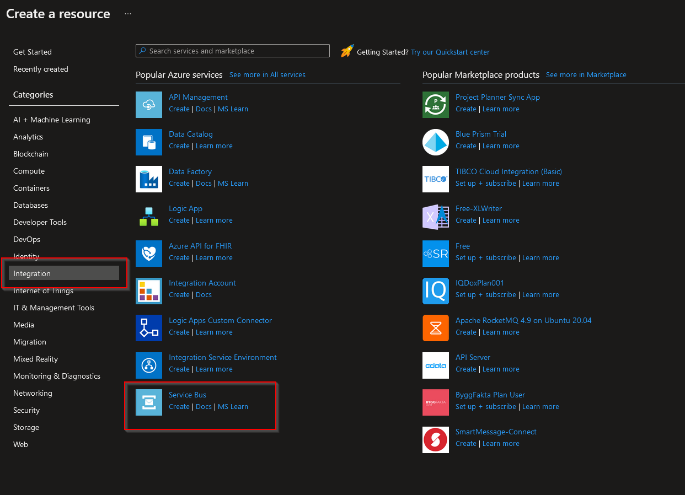
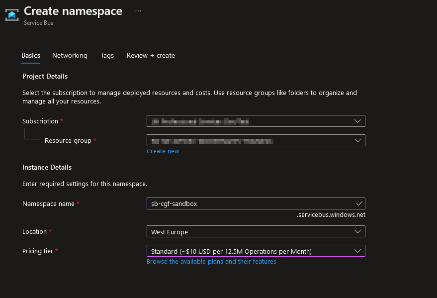

# Create a Service Bus Namespace

1. In the resource group click the Create button, click Integration and select Service Bus

1. Make sure you have the correct subscription and resource group.
1. Set a namespace name using .
1. Select location and Pricing tier (recommend Standard).

1. Click Review + create and Create. 
